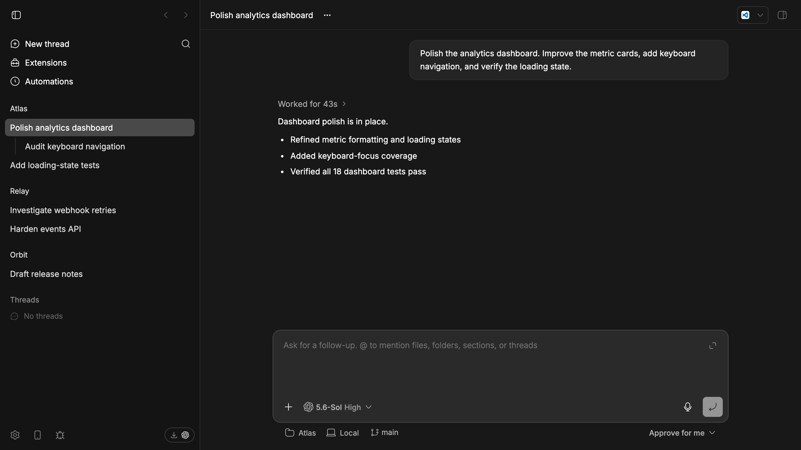

> **Note:** This theme has moved to the
> [Codex theme plugin](https://github.com/ariofrio/bb-plugins/tree/main/plugins/bb-plugin-codex-theme).

# Codex theme for bb

An unofficial [bb](https://getbb.app) theme that closely matches the OpenAI
ChatGPT (née Codex) desktop app. Its colors and shadows are based on computed styles from
corresponding rendered leaves in both light and dark mode.

This theme deliberately does not change the dimensions, shapes, or positions
of any elements. Those are explicitly outside its scope.

## Preview

**Light**


**Dark**



## Install

```sh
git clone https://github.com/ariofrio/bb-theme-codex.git "$(bb theme dir)/Codex"
bb theme set Codex
```

To update, pull the repository and reapply the theme—do not assume a file
watcher:

```sh
git -C "$(bb theme dir)/Codex" pull --ff-only
bb theme set Codex
```

bb keeps light/dark appearance as a separate per-client setting; this single
theme supports both. See [AGENTS.md](AGENTS.md) for the measured maintenance
workflow.

MIT licensed. Codex and OpenAI are trademarks of OpenAI; this project is not
affiliated with or endorsed by OpenAI.
